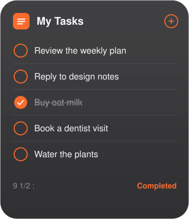

# Tasks for Mac

<p align="center">
  
</p>

<p align="center">
  A native macOS <strong>desktop widget</strong> for <a href="https://tasks.google.com">Google Tasks</a>, with a small companion app that looks like Reminders.<br>
  <a href="https://erboland.github.io/mac-gtasks">Website</a>
  ·
  <a href="https://github.com/erboland/mac-gtasks/releases/latest">Download</a>
  ·
  <a href="https://erboland.github.io/mac-gtasks/privacy.html">Privacy</a>
</p>

Check items off from the desktop or Notification Center. Open the app when you need the full list, completed tasks, or a new reminder.

Requires **macOS 14 Sonoma** or later. MIT licensed. Not affiliated with Apple or Google.

## Download

1. Get **Tasks.dmg** from the [latest release](https://github.com/erboland/mac-gtasks/releases/latest).
2. Drag **Tasks** into **Applications**.
3. Open the app. Onboarding explains that this is a widget first, then asks you to sign in with Google.
4. Control-click the desktop → **Edit Widgets** → search **Tasks** → add **List**.

If macOS blocks the app, Control-click it and choose **Open**. A notarized Developer ID build removes that warning.

## Features

- Interactive List widget (Small / Medium / Large / Extra Large) with circular checkboxes
- Switch lists from the widget title; **+** creates a task
- Companion app: sidebar of lists, strikethrough on complete, Show Completed
- Completions sync to Google Tasks from the widget and the app

## Build from source

```bash
git clone https://github.com/erboland/mac-gtasks.git
cd mac-gtasks
cp Shared/GoogleAuthSecrets.example.swift Shared/GoogleAuthSecrets.swift
open Tasks.xcodeproj
```

Paste a Google **Desktop** OAuth client into `GoogleAuthSecrets.swift`, set your Apple **Team** on both targets, then Run (⌘R).

The secrets file is gitignored. The first Xcode build copies the example if it is missing.

### Google OAuth (maintainers)

1. [Google Cloud Console](https://console.cloud.google.com/) → enable **Google Tasks API**.
2. OAuth consent screen: homepage [erboland.github.io/mac-gtasks](https://erboland.github.io/mac-gtasks), privacy [privacy.html](https://erboland.github.io/mac-gtasks/privacy.html).
3. For the public, publish the consent screen and complete Google’s verification for the Tasks scope. Until then, add people as test users.
4. Create an OAuth client ID, type **Desktop app**.
5. For GitHub Releases, store `GOOGLE_CLIENT_ID` and `GOOGLE_CLIENT_SECRET` as repository secrets, then `git tag v1.0.0 && git push github v1.0.0`.

### Package a DMG locally

```bash
bash scripts/package-dmg.sh
# → build/Tasks.dmg
```

## How sync works

```
Google Tasks API  ←→  Tasks.app  ←→  local snapshot  ←→  Widget
                              ↖ complete from widget (App Intent)
```

OAuth tokens stay on the Mac so the widget can complete tasks when the window is closed.

## Project layout

```
Tasks.xcodeproj          App + widget extension
Tasks/                   Companion macOS app
TasksWidget/             WidgetKit List widget
Shared/                  Models, Google client, snapshot store, App Intents
docs/                    GitHub Pages site
scripts/package-dmg.sh   Disk image for Releases
```

## Contributing

See [CONTRIBUTING.md](CONTRIBUTING.md). Please read [SECURITY.md](SECURITY.md) before filing issues about credentials or tokens.

## License

[MIT](LICENSE)
